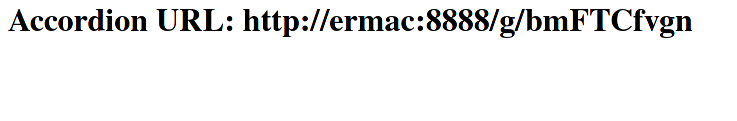

# accordion

`accordion` is a URL shortener that works in a similar fashion to `TinyURL`.

`accordion` is written for fun and for educational purposes only. __Please do not use `accordion` in a production setting!__ Typical features present in production `HTTP` servers like `https` support are not implemented!
### Dependencies

* [libmicrohttpd](https://www.gnu.org/software/libmicrohttpd/)
* [hiredis](https://github.com/redis/hiredis)
* [CMake](https://cmake.org/)

### Building

Once the dependencies above are installed on your system, run the following in the root of the source tree:

```
mkdir build
cd build
cmake -DCMAKE_BUILD_TYPE=release ..
cmake --build .
```

This will build the `accordion` binary in the `build` directory.

### Running

By default, `accordion` will listen on port `8888`. To change this port, start `accordion` with the port as an argument. e.g. `accordion 12345` will listen on port `12345`. `accordion` also requires an active `redis` connection on `localhost:6379`. At the moment, this is *not* configurable but perhaps a brave developer can put together a PR to add it in :) To quit `accordion`, simply press `Ctrl+D` in your terminal or kill the process.

When `accordion` is launched, you can browse to `<hostname>:<port>` on your browser and you'll be greeted with a (super) simple form to enter your URL that you wish to minify. Enter your URL and click `Submit`.


Once you submit, `accordion` will generate a minified URL (called the `accordion URL`) and return it to you in a beautiful page:



Once you have this accordion URL, you can now navigate to it in your browser and `accordion` will redirect you back to the orginal URL you entered :) In this case, that's `DuckDuckGo`.

### Limitations

- [ ] no `https` support for `accordion`
- [ ] long URLs are not checked for validity and must start with the protocol (`http(s)://`)
- [ ] only compatible with *nix systems


